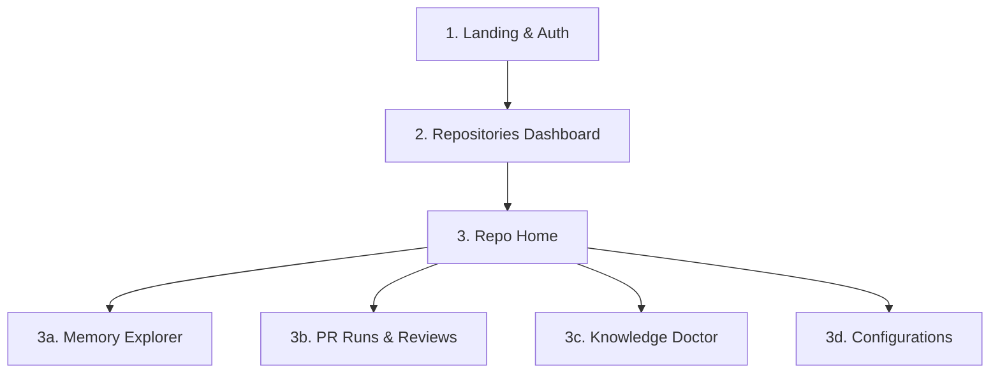

# Product Requirement Document (PRD): Precedent Web Dashboard

This document outlines the UX requirements, page flows, feature specifications, and integrations for the **Precedent Web Dashboard**.

---

## 1. Product Vision

The Precedent Web Dashboard is the control center for repository memory. It provides a visual hub where developers, maintainers, and team leads can inspect their repository's AI memory, configure checks, resolve conflicts, review automated mergeability reports, and manage integrations.

---

## 2. User Journeys & Flows

### Flow A: Onboarding & First Memory Build (Zero to One)
1. **Sign In**: User arrives at landing page and authenticates via **GitHub OAuth**.
2. **Install App**: Dashboard redirects the user to install the Precedent GitHub App on selected repositories.
3. **Repository Selection**: Dashboard lists all authorized repositories. User selects one and clicks **"Initialize Memory"**.
4. **First Build**: Precedent triggers the background Vercel Eve agent. The user sees a real-time terminal-style stream showing PR fetching, distillation, and validation.
5. **Success Landing**: Once complete, the user is navigated to the Repository Memory view, displaying the compiled knowledge files.

### Flow B: Resolving Memory Conflicts (The "Doctor" Flow)
1. **Notification**: User is alerted (via email or dashboard indicator) that a recent PR build has introduced conflicting information (e.g. conflicting code style or design decisions).
2. **Review Conflicts**: User navigates to the **Knowledge Doctor** page.
3. **Side-by-Side Comparison**: The UX displays conflicting statements side-by-side with source PR links.
4. **Resolve**: User clicks the correct statement (or edits it manually) and clicks **"Apply Resolution"**. The database updates and compiles a clean export.

### Flow C: Reviewing a Blocked PR
1. **GitHub Alert**: A developer submits a PR. The Precedent GitHub App status check fails (`BLOCK`).
2. **Link Follow**: The developer clicks the "Details" link on the GitHub check and is taken to the Precedent PR Review Page.
3. **Blocker Analysis**: The user views the **Mergeability Report** showing the blocker list (e.g. repeated failure found in `#241`, missing async rollback mechanism).
4. **Action**: The developer reads the recommended fix, updates their local code, and pushes, triggering an automatic re-run.

---

## 3. Information Architecture & Page-by-Page UX

### 1. Landing & Authentication Page
*   **Purpose**: Introduce Precedent and get user authentication.
*   **Core Elements**:
    *   One-click **"Sign In with GitHub"** button.
    *   Brief description of PR checks and repository memory.

### 2. Main Projects Dashboard
*   **Purpose**: Display all repositories the user has access to.
*   **Core Elements**:
    *   **Repository List Card**: Displays Repo Name, Status (Healthy / Conflicts / Idle), Last Build Timestamp, and active PR Check state.
    *   **Add Repository Button**: Triggers GitHub App permission page.
    *   **Quick Stats**: Total PRs audited this week, number of blockers caught, total compiled memory records.

### 3. Repository View (Tabs)

#### Tab A: Memory Explorer
*   **Purpose**: Provide a visual representation of the structured JSON database.
*   **Core Elements**:
    *   **Category Sidebar**: Quickly switch between Architecture, Failure Database, Maintainer Preferences, Pitfalls, Timeline, and Contributor Playbook.
    *   **Interactive List Views**: 
        *   *CDDs*: Searchable list of Critical Design Decisions (Click to expand context, alternatives, tradeoffs, and source PR).
        *   *Checklists*: Review checklist questions generated from failure history.
        *   *Timeline*: Clickable interactive timeline of previous PR releases.

#### Tab B: PR Reviews & Runs
*   **Purpose**: List all PR audits run on the repo.
*   **Core Elements**:
    *   **Run History Table**: Lists PR Number, PR Title, Date, Submitter, and Gate Score (`PASS` / `FLAG` / `BLOCK`).
    *   **Detailed Run Log**: Click a run to open the consolidated **Mergeability Report** showing:
        *   *Consolidated Blocker Panel*: Shows issues categorized by severity with citations to files and lines.
        *   *Parallel Agent Insights*: Dropdowns showing raw outputs from `assumption_hunter`, `test_gap`, `maintainer`, and `pr_reviewer`.

#### Tab C: Knowledge Doctor
*   **Purpose**: Manage logical contradictions or duplicate items flagged by the validation subagent.
*   **Core Elements**:
    *   **Validation Diagnostic Card**: Displays the current confidence and completeness scores.
    *   **Actionable Conflict Cards**: Grouped duplicates/conflicts. User can choose "Keep Left", "Keep Right", "Merge", or "Ignore Warning".

#### Tab D: Configurations & Settings
*   **Purpose**: Configure repository behavior and billing.
*   **Core Elements**:
    *   **Trigger Build Button**: Force an immediate rebuild/refresh of the repository memory.
    *   **Auditing Thresholds**: Select threshold level (Strict: Blocks on warnings; Balanced: Blocks on critical issues only; Alert-only).
    *   **API Tokens Panel**: Add custom environment variables or repository-specific OpenAI/Gemini/GitHub keys.

---

## 4. Integration Requirements

### Vercel Eve API Integration
*   **Session Handshake**: Dashboard connects to `POST /eve/v1/session` to trigger asynchronous build and review workflows.
*   **SSE Streaming**: Page-side loader reads SSE streams from `/eve/v1/session/:sessionId/stream` to update terminal-style build logs.
*   **Memory Reads**: Reads raw JSON schemas (`architecture.json`, etc.) from the serverless database / Vercel KV store to populate the Memory Explorer.

### GitHub Integration
*   **Status Check API**: Enforces status checks on GitHub commit refs.
*   **PR Commenter**: App writes markdown-formatted mergeability summary reports directly to pull request conversation threads.

### Stripe Billing Integration
*   **Subscription Gates**: Checks customer subscription level before running `build` or `review` triggers for private or commercial repositories.
